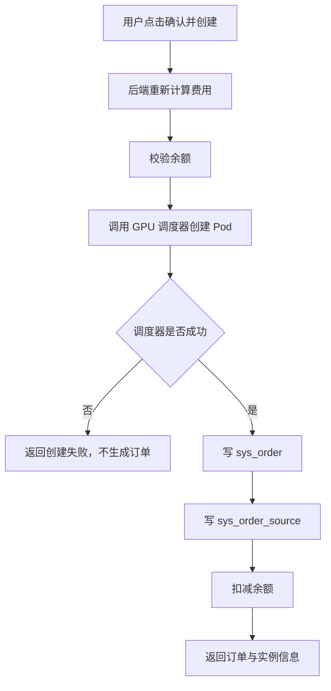
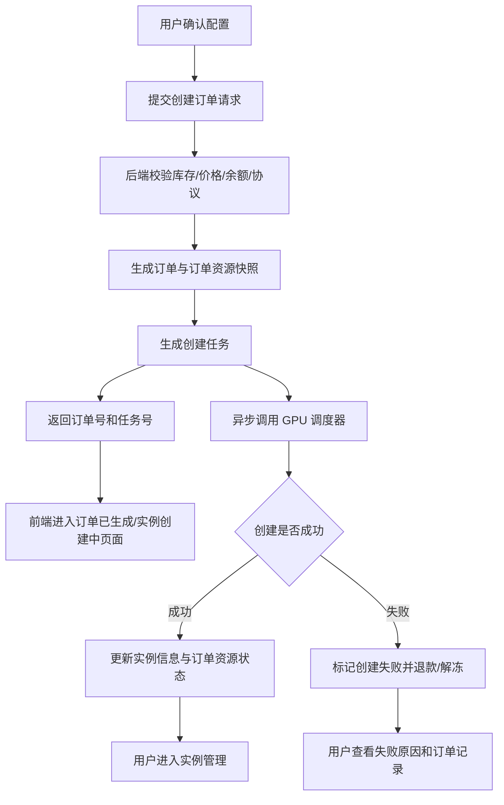

# GPU 租用订单创建问题与优化建议

## 1. 背景

当前用户在算力市场选择 GPU 资源后，会从 `computeListNew` 进入 `computeRent` 确认页，并点击「确认并创建」完成购买与实例创建。

本次梳理聚焦问题：点击「确认并创建」后，系统是否生成订单、订单信息是否完整，以及后续如何优化为更稳定、更接近云厂商购买体验的流程。

## 2. 当前实现概览

### 2.1 前端链路

相关文件：`ux-user-main/src/view/computeRent/index.vue`

当前 `handleSubmit()` 流程如下：

1. 校验当前是否可提交，包括资源、镜像版本、费用结果等。
2. 调用 `buildPodCreateRequest()` 组装 GPU Pod 创建参数。
3. 调用 `createRentOrder(params)` 请求后端 `/pc/gpu/rent/order`。
4. 接口成功后，将返回值写入 `createdOrder`。
5. 页面展示「实例已提交创建」结果页，显示订单号、实例 ID、实例名称、实付金额、创建时间。
6. 用户可继续点击「查看订单」或「管理实例」。

前端请求接口位于：`ux-user-main/src/api/computeRent.ts`

```ts
export function createRentOrder(data: CreateOrderParams): Promise<ApiResponse<OrderResult>> {
  return request({
    url: '/pc/gpu/rent/order',
    method: 'post',
    data,
    timeout: 5 * 60 * 1000
  })
}
```

### 2.2 后端链路

相关文件：`console-main/ai-cloud-system/src/main/java/com/lingyang/cloud/api/controller/pc/PcGpuRentController.java`

当前 `/pc/gpu/rent/order` 实际流程如下：

1. 调用 `calculate(dto)` 在服务端重新计算费用。
2. 校验用户余额是否足够。
3. 从登录态生成 `tenantId`、`tenantName`，写入 Pod 创建请求。
4. 调用外部 GPU 调度器 `gpuPodApiClient.createGpuPod(request)` 创建 GPU Pod。
5. 调度器返回成功后，调用 `createPaidGpuOrder(...)` 创建本地订单。
6. 写入 `sys_order`，订单状态直接设置为 `PAID`。
7. 写入 `sys_order_source`，资源类型为 `GPU_SERVER`。
8. 将 Pod 创建参数和部分调度器响应写入 `config_detail`。
9. 调用 `sysCustomerService.updateCustomerBalance(...)` 扣减余额。
10. 返回订单号、金额、创建时间、实例信息给前端。

因此，当前流程不是“先生成订单，再创建实例”，而是：



## 3. 当前已保存的订单信息

### 3.1 主订单 `sys_order`

当前已保存的信息包括：

- 订单 ID
- 订单号
- 订单类型：`NEW_RESOURCE`
- 原价：`originalPrice`
- 溢价价格：`premiumPrice`
- 用户折扣金额：`userDiscountAmount`
- 最终支付金额：`finalPayAmount`
- 余额支付金额：`balancePayAmount`
- 在线支付金额：`onlinePayAmount`
- 优惠券金额：`couponAmount`
- 代金券金额：`voucherAmount`
- 订单状态：`PAID`
- 支付时间：`payTime`
- 创建人、更新人

### 3.2 订单资源明细 `sys_order_source`

当前已保存的信息包括：

- 订单 ID
- 订单号
- 资源 ID：`sourceId = instanceId`
- 资源类型：`GPU_SERVER`
- 资源名称：`sourceName = podName / instanceId`
- 产品名称：`GPU Pod - GPU型号`
- 产品类型：`productType = 2`
- 配置详情：`configDetail`
- 计费类型：`chargeType`
- 购买时长：`duration`
- 时长单位：`durationUnit`
- 数量：`number`
- 单价：`unitPrice`
- 溢价价格：`premiumPrice`
- 最终单价：`finalUnitPrice`
- 优惠券/代金券抵扣金额

### 3.3 配置快照 `config_detail`

当前写入 `config_detail` 的信息主要来自 `GpuPodCreateRequest`，包括：

- 租户 ID：`tenantId`
- 租户名称：`tenantName`
- GPU 配置：`gpuSpec`
- 镜像地址：`image`
- 计费配置：`billing`
- CPU、内存、磁盘配置：`resource`
- 价格信息：`pricing`
- Pod 名称：`podName`
- 地域：`region`
- 可用区：`zone`
- 机器 ID：`machineId`
- GPU 驱动：`gpuDriver`
- CUDA 版本：`cudaVersion`
- 资源 ID：`resourceId`
- 镜像 ID：`mirrorId`
- 镜像版本 ID：`mirrorVersionId`
- 实例 ID：`instanceId`
- Pod 命名空间：`podNamespace`
- 创建结果消息：`createMessage`

## 4. 主要问题

### 4.1 订单生成时机偏晚

当前是外部调度器创建成功后才生成本地订单。

问题影响：

- 如果调度器创建失败，不会生成订单，用户无法在订单中心看到失败记录。
- 如果调度器创建成功，但后续写订单、写订单明细、扣余额失败，数据库事务会回滚，但外部 Pod 不会自动回滚，可能出现“实例已创建但订单不存在”的不一致状态。
- 售后排查时缺少一条稳定的订单记录作为主线。

### 4.2 同步等待时间过长

GPU Pod 创建可能持续 1 到 3 分钟，当前接口是同步等待。

问题影响：

- 用户会长时间停留在提交中状态。
- 浏览器刷新、网络抖动、接口超时后，用户无法确认到底有没有创建成功。
- 后端请求仍可能继续执行，前端已经认为失败，容易诱发重复提交。

### 4.3 缺少幂等控制

当前请求参数中没有明确的 `clientRequestId`、`idempotencyKey` 或创建任务号。

问题影响：

- 用户重复点击可能生成多个创建请求。
- 前端超时后再次提交，可能重复创建实例和订单。
- 后端无法通过请求唯一键判断“这是同一次购买请求的重试”。

### 4.4 外部副作用与本地事务不一致

`@Transactional` 只能保证本地数据库事务，不能回滚外部调度器已经创建的 Pod。

问题影响：

- 调度器成功、本地事务失败时会产生孤立实例。
- 本地订单成功、扣费失败时可能产生支付状态异常。
- 缺少失败补偿、重试、对账机制。

### 4.5 订单信息不够完整

当前 `config_detail` 已保存一部分配置，但仍缺少面向审计、售后、用户核对的完整快照。

建议补齐的信息包括：

- 资源编号、资源名称、机器 UUID、节点池、集群 ID、集群名称。
- 镜像名称、镜像版本名称、镜像来源、框架版本、Python 版本。
- 自动续费 `autoRenew`。
- 购买来源 `source`，例如 `computeListNew`。
- 协议确认状态、协议版本、确认时间。
- 服务端价格快照、价格版本、折扣规则。
- 调度器请求 ID、调度器响应原文、失败原因。
- 创建任务 ID、任务状态、最近更新时间。

### 4.6 `agreeProtocol` 审计价值不足

当前前端提交时直接传 `agreeProtocol: true`，后端也没有看到强制校验。

问题影响：

- 无法证明用户在本次订单中真实确认了协议。
- 协议版本、确认时间缺失，不利于后续审计。

### 4.7 `autoRenew` 未进入订单参数

当前页面 URL 里可能包含 `autoRenew`，但 `CreateOrderParams` 与 `GpuRentOrderDTO` 中没有明确字段。

问题影响：

- 包月、包周、包天订单无法完整记录续费意图。
- 后续订单详情、续费策略、售后解释缺少依据。

### 4.8 价格快照存在信任边界问题

订单金额使用后端重新计算，这是正确方向。但 `config_detail.pricing` 主要来自前端 `podCreateRequest`。

问题影响：

- 如果前端价格字段被篡改，订单主金额正确，但配置快照里的价格展示可能不准确。
- 订单详情页可能展示与真实扣费不一致的价格信息。

## 5. 建议目标流程

建议改造为“订单先落库，实例异步创建”的云厂商式链路。



目标体验：

- 用户点击后快速获得订单号。
- 页面展示“订单已生成，实例创建中”。
- 实例创建状态可轮询或通过订单详情查看。
- 创建失败也有订单记录、失败原因和退款/解冻记录。
- 重试不会重复创建实例。

## 6. 建议补齐的订单字段

### 6.1 订单主信息

- 订单 ID
- 订单号
- 订单类型
- 订单状态
- 支付状态
- 创建时间
- 支付时间
- 用户 ID
- 客户名称
- 租户 ID
- 租户名称
- 购买来源
- 幂等键

### 6.2 商品与资源快照

- 资源 ID
- 资源编号
- 资源名称
- GPU 型号
- GPU 数量
- 显存
- CPU 核数
- CPU 型号
- 内存
- 系统盘
- 数据盘
- 扩容盘大小
- 地域
- 可用区
- 机器 ID
- 机器 UUID
- 集群 ID
- 集群名称
- 节点池 ID
- 节点池名称

### 6.3 镜像快照

- 镜像 ID
- 镜像名称
- 镜像版本 ID
- 镜像版本名称
- 镜像地址
- 镜像来源
- 框架类型
- 框架版本
- Python 版本
- CUDA 版本
- GPU 驱动版本

### 6.4 计费与价格快照

- 计费类型
- 购买时长
- 时长单位
- 购买数量
- 自动续费
- 到期时间
- 单价
- 原价
- 折扣价
- 实付金额
- 币种
- 价格版本
- 优惠券 ID
- 优惠券金额
- 代金券 ID
- 代金券金额
- 余额支付金额
- 在线支付金额

### 6.5 创建任务与调度快照

- 创建任务 ID
- 创建任务状态
- 实例 ID
- 实例名称
- Pod 名称
- Pod Namespace
- 调度器请求 ID
- 调度器响应消息
- 调度器响应原文
- 失败原因
- 最近一次状态更新时间

### 6.6 协议与审计信息

- 是否确认协议
- 协议版本
- 协议确认时间
- 客户端 IP
- User-Agent
- 操作人 ID
- 操作人名称

## 7. 后续优化建议

### P0：先解决一致性和重复提交

1. 增加幂等键，前端每次进入确认页生成一次 `clientRequestId`。
2. 后端基于幂等键保证同一次请求只生成一个订单和一个创建任务。
3. 订单先落库，状态可为 `CREATING` 或 `PENDING_CREATE`。
4. 调度器调用改为异步任务，避免前端长时间等待。
5. 增加失败状态和失败原因记录。

### P1：补齐订单快照

1. 后端基于数据库资源、镜像、价格结果生成服务端订单快照。
2. `config_detail.pricing` 使用服务端计算结果覆盖前端传值。
3. 增加 `autoRenew`、`source`、协议确认信息。
4. 订单详情页展示 GPU 专属字段，不只展示通用订单字段。

### P2：补齐售后和运维能力

1. 增加创建任务状态查询接口。
2. 增加调度器创建失败后的退款/解冻逻辑。
3. 增加孤立 Pod 对账任务。
4. 增加订单号、任务号、实例 ID、Pod 名称之间的链路追踪。

## 8. 推荐接口调整

### 8.1 创建订单接口

建议将当前 `/pc/gpu/rent/order` 改造成快速返回接口。

请求建议增加：

```json
{
  "clientRequestId": "string",
  "resourceId": 6,
  "mirrorId": "string",
  "mirrorVersionId": "string",
  "billingType": "monthly",
  "quantity": 1,
  "duration": 1,
  "autoRenew": false,
  "source": "computeListNew",
  "agreeProtocol": true,
  "agreementVersion": "string",
  "podCreateRequest": {}
}
```

响应建议返回：

```json
{
  "orderId": "string",
  "orderNo": "string",
  "createTaskId": "string",
  "status": "CREATING",
  "totalAmount": 100,
  "paidAmount": 100,
  "createTime": "2026-07-31 10:00:00"
}
```

### 8.2 创建状态查询接口

建议新增：`GET /pc/gpu/rent/order/create-status?orderNo=xxx`

响应建议：

```json
{
  "orderNo": "string",
  "createTaskId": "string",
  "createStatus": "CREATING",
  "instanceId": "string",
  "instanceName": "string",
  "podName": "string",
  "message": "实例创建中",
  "failureReason": ""
}
```

## 9. 前端页面建议

### 9.1 确认页

- 按阿里云购买页思路展示完整配置清单。
- 明确展示计费方式、时长、数量、自动续费、费用明细。
- 协议勾选必须由用户真实操作产生。
- 点击按钮后展示创建进度，不允许重复提交。

### 9.2 创建结果页

- 成功提交后立即展示订单号和创建任务状态。
- 文案建议为“订单已生成，实例创建中”。
- 提供“查看订单”“查看实例”“返回算力市场”入口。
- 如果创建失败，展示失败原因和退款/解冻说明。

### 9.3 订单详情页

- 增加 GPU 专属配置分组。
- 展示资源信息、镜像信息、计费信息、实例创建信息。
- 展示失败原因和调度器消息。
- 展示自动续费与协议确认信息。

## 10. 结论

当前系统会生成订单，但订单生成发生在 GPU Pod 创建成功之后，且订单状态直接为已支付。这种实现能跑通基本购买链路，但在长耗时创建、重复提交、外部调度失败、本地事务回滚、订单信息完整性方面存在明显风险。

后续优化建议优先围绕三个方向推进：

1. 订单先落库，实例创建异步化。
2. 增加幂等键、创建任务、失败补偿和状态查询。
3. 补齐订单快照，让订单中心能够完整还原用户购买时的资源、镜像、计费、协议和调度信息。
