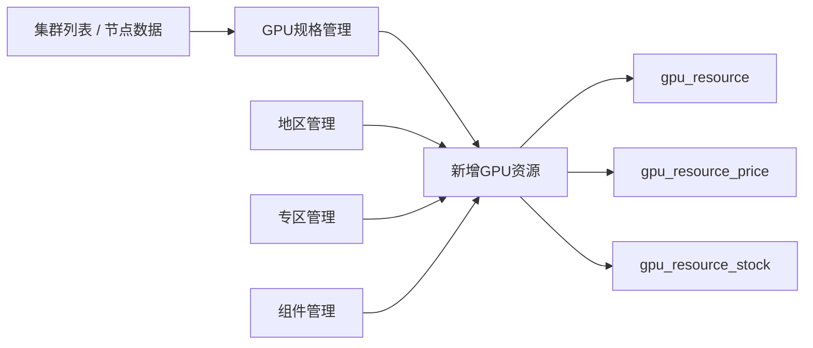

# GPU资源新增数据串联逻辑

## 背景

管理后台“新增GPU资源”表单当前包含：基本信息、GPU配置、CPU & 内存、存储、价格配置、库存配置。用户期望这些字段不再主要依赖手填，而是从 AI 算力中心下的配置菜单和集群数据中串联带出：

- 地区管理
- 专区管理
- GPU规格管理
- 集群管理 / 集群列表
- 集群管理 / 组件管理

目标是形成一条稳定的数据链路：先维护基础字典和集群来源数据，再在新增 GPU 资源时选择上游数据，自动填充机器、规格、资源容量、库存、价格和组件配置。

## 当前代码现状

新增资源入口：

- 前端页面：`ux-admin-main/src/views/gpu/resource/index.vue`
- 抽屉组件：`ux-admin-main/src/views/gpu/resource/components/ResourceDrawer.vue`
- 后端保存接口：`POST /system/gpu/resource/save`
- 后端入参：`GpuResourceEdit`
- 后端保存：`GpuResourceServiceImpl.saveOrUpdate`

当前新增资源抽屉已经接入：

- `gpuSpecListApi()`：`GET /system/gpu/spec/list`
- `gpuRegionListApi()`：`GET /system/gpu/region/list`
- `gpuZoneListApi()`：`GET /system/gpu/zone/list`

当前 GPU规格管理已经接入：

- `gpuClusterNodesApi()`：`GET /system/gpu/cluster/node/page`
- 新增 GPU 规格时可选择集群节点，并带出 GPU 型号、GPU 数量、CPU、内存、磁盘等字段。

当前组件管理只用于列表展示：

- `gpuComponentListApi()`：`GET /system/gpu/cluster/component/page`
- 目前没有进入新增 GPU 资源表单，也没有保存到 `gpu_resource` 相关表。

## 目标串联关系

## 数据来源与字段映射

### 1. 地区管理

数据接口：

- `GET /system/gpu/region/list`

来源字段：

| 来源字段 | 用途 | 新增资源字段 |
| --- | --- | --- |
| `regionCode` | 地区编码，保存到资源主表 | `regionCode` |
| `regionName` | 下拉显示、列表展示 | 不直接保存名称 |
| `status` | 只应展示启用数据 | 前端筛选 `status === 1` |
| `sortOrder` | 下拉排序 | 下拉排序 |

建议逻辑：

- 新增资源时“地区”下拉只展示启用地区。
- 保存资源时只保存 `regionCode`。
- 资源列表展示时后端继续通过 `regionCode` 反查 `regionName`。

### 2. 专区管理

数据接口：

- `GET /system/gpu/zone/list`

来源字段：

| 来源字段 | 用途 | 新增资源字段 |
| --- | --- | --- |
| `zoneCode` | 专区编码，保存到资源主表 | `zoneCode` |
| `zoneName` | 下拉显示、列表展示 | 不直接保存名称 |
| `status` | 只应展示启用数据 | 前端筛选 `status === 1` |
| `sortOrder` | 下拉排序 | 下拉排序 |

当前问题：

- `gpu_zone` 实体当前没有 `regionCode` 字段，前端 `getZonesByRegion()` 实际返回了全部专区，无法按地区过滤。

建议逻辑：

- 短期：专区下拉展示启用专区，不按地区联动。
- 中期：给 `gpu_zone` 增加 `region_code`，专区管理维护所属地区，新增资源选择地区后只展示对应专区。
- 保存资源时只保存 `zoneCode`。

### 3. 集群列表 / 集群节点

数据接口：

- `GET /system/gpu/cluster/page`
- `GET /system/gpu/cluster/node/page`
- `GET /system/gpu/cluster/summary?clusterId={clusterId}`

调度器来源：

- `GET /api/v1/admin/clusters/nodes?authKey=...`
- `GET /api/v1/admin/clusters/summary?cluster_id=...&authKey=...`

集群节点返回关键字段：

| 节点字段 | 含义 | 推荐用途 |
| --- | --- | --- |
| `node_name` | 节点机器名 | 可作为 `machineId`、`machineUuid` 默认值 |
| `region` | 节点所在地区 | 可辅助匹配 `regionCode` |
| `gpu_model` | GPU 型号 | 生成/选择 GPU 规格 |
| `gpu_count` | 节点 GPU 总数 | 资源 `gpuCount`、库存 `totalCount` |
| `allocated_gpus` | 已分配 GPU 数 | 计算可用库存 |
| `available_gpus` | 可用 GPU 数 | 库存 `availableCount` |
| `cpu.total_cores` | CPU 总核数 | 资源 `cpuCores` |
| `cpu.model` / 相关字段 | CPU 型号 | 资源 `cpuModel` |
| `memory.total_gi` | 内存 GiB | 资源 `memorySize` |
| `disk.total_gi` | 最大挂载盘 GiB | 资源 `dataDisk` |
| `status` | 节点状态 | 资源状态默认值 |

建议新增资源逻辑：

- 新增资源第一步可增加“来源节点”选择框。
- 来源节点从 `GET /system/gpu/cluster/node/page` 获取。
- 选择节点后自动带出：
  - `machineId = node_name`
  - `machineUuid = node_name`，如果后续调度器有真实 UUID，应改用真实 UUID
  - `gpuCount = gpu_count`
  - `cpuCores = cpu.total_cores`
  - `memorySize = memory.total_gi + " GiB"`
  - `dataDisk = disk.total_gi + " GiB"`
  - `totalCount = gpu_count`
  - `availableCount = available_gpus`
  - `status = Ready ? 上架 : 维护中`

### 4. GPU规格管理

数据接口：

- `GET /system/gpu/spec/list`

当前规格来源：

- GPU规格管理新增时可以选择集群节点，自动生成规格。
- 规格实体已经保存：
  - `clusterNodeName`
  - `clusterStatus`
  - `gpuCount`
  - `allocatedGpus`
  - `availableGpus`
  - `cpuTotalCores`
  - `cpuModel`
  - `memoryTotalGi`
  - `diskTotalGi`

新增资源表单当前逻辑：

- 选择 `specId` 后，`onSpecChange()` 会带出：
  - `gpuCount`
  - `cpuCores`
  - `cpuModel`
  - `memorySize`
  - `dataDisk`
  - `systemDisk`
  - `totalCount`
  - `availableCount`
  - `machineId`
  - `machineUuid`
  - `status`

建议逻辑：

- GPU规格仍作为新增资源的核心选择项。
- 如果规格来自集群节点，新增资源选择规格时继续自动填充机器和容量信息。
- 如果同一个规格可能对应多个节点，应不要只靠 `spec.clusterNodeName`，需要在新增资源里选择具体节点；规格只负责模板字段，节点负责具体机器身份与库存。

### 5. 组件管理

数据接口：

- `GET /system/gpu/cluster/component/page`

来源字段：

| 来源字段 | 含义 | 推荐用途 |
| --- | --- | --- |
| `id` | 组件 ID | 新增资源保存组件关联 |
| `componentName` | 组件名称 | 表单多选显示 |
| `baseImage` | 基础镜像 | 资源默认运行环境 |
| `imageAddress` | 镜像地址 | 下发/创建 GPU Pod 时使用 |
| `description` | 说明 | 辅助展示 |
| `status` | 状态 | 只展示启用组件 |

当前缺口：

- `GpuResourceEdit` 没有组件字段。
- `gpu_resource` 没有组件关联字段。
- 新增资源抽屉没有组件选择 UI。

建议逻辑：

- 新增资源增加“组件配置”区块，支持多选启用组件。
- 后端新增资源与组件关联表，例如 `gpu_resource_component`：
  - `resource_id`
  - `component_id`
  - `component_name`
  - `image_address`
  - `sort_order`
- 保存资源时同步保存组件关联。
- 创建实例或展示资源详情时，可从资源关联组件获取基础镜像和镜像地址。

## 新增 GPU 资源推荐交互流程

### Step 1：打开新增资源

前端并行加载：

- 地区列表：`/system/gpu/region/list`
- 专区列表：`/system/gpu/zone/list`
- GPU规格列表：`/system/gpu/spec/list`
- 集群节点列表：`/system/gpu/cluster/node/page`
- 组件列表：`/system/gpu/cluster/component/page`

前端过滤：

- 地区：只显示 `status === 1`
- 专区：只显示 `status === 1`
- 规格：只显示 `status === 1`
- 组件：只显示 `status === 1`
- 集群节点：建议优先显示 `status === "Ready"` 且 `available_gpus > 0`

### Step 2：选择来源节点或 GPU规格

推荐优先顺序：

1. 选择来源节点。
2. 根据节点 `gpu_model` 自动匹配规格。
3. 如果没有匹配规格，提示先到 GPU规格管理中创建规格，或支持“一键生成规格”。
4. 选择规格后填充资源模板字段。

字段带出：

| 新增资源字段 | 优先来源 | 兜底来源 |
| --- | --- | --- |
| `machineId` | 集群节点 `node_name` | 手填 |
| `machineUuid` | 集群节点真实 UUID，如无则 `node_name` | 手填 |
| `regionCode` | 节点 `region` 映射地区管理 | 手选 |
| `zoneCode` | 地区联动后的专区 | 手选 |
| `specId` | `gpu_model` 匹配规格 | 手选 |
| `gpuCount` | 节点 `gpu_count` | 规格 `gpuCount` |
| `cpuCores` | 节点 `cpu.total_cores` | 规格 `cpuTotalCores` |
| `cpuModel` | 节点 CPU 型号 | 规格 `cpuModel` |
| `memorySize` | 节点 `memory.total_gi` | 规格 `memoryTotalGi` |
| `dataDisk` | 节点 `disk.total_gi` | 规格 `diskTotalGi` |
| `availableCount` | 节点 `available_gpus` | 规格 `availableGpus` |
| `totalCount` | 节点 `gpu_count` | 规格 `gpuCount` |
| `status` | 节点 `Ready` -> 上架，否则维护中 | 默认上架 |

### Step 3：选择地区和专区

推荐规则：

- 如果节点 `region` 能匹配 `gpu_region.regionCode` 或 `regionName`，自动选中地区。
- 用户选择地区后，专区下拉只显示该地区下的启用专区。
- 当前 `gpu_zone` 没有地区字段时，先展示全部启用专区。

### Step 4：选择组件

新增“组件配置”：

- 支持多选组件。
- 默认可选全部启用组件。
- 选择组件后展示：
  - 组件名称
  - 基础镜像
  - 镜像地址

组件信息不建议塞进 `gpu_resource` 主表，建议用关联表保存。

### Step 5：价格和库存

价格：

- 当前表单固定生成 `on_demand/hourly/daily/weekly/monthly` 五种价格。
- 保存到 `gpu_resource_price`。
- 建议后续支持从规格或价格模板带出默认价格。

库存：

- 当前保存到 `gpu_resource_stock`。
- 如果来源是单个集群节点：
  - `totalCount = gpu_count`
  - `availableCount = available_gpus`
- 用户仍可手动调整，但应校验：
  - `availableCount <= totalCount`
  - `totalCount <= gpuCount`

## 后端保存关系

当前保存：

- `gpu_resource`
  - 机器、地区、专区、规格、GPU/CPU/内存/磁盘、状态等主信息
- `gpu_resource_price`
  - 多种计费类型价格
- `gpu_resource_stock`
  - 总库存和可用库存

建议新增：

- `gpu_resource_component`
  - 资源与组件镜像关联
- 可选：`gpu_resource_source`
  - 保存来源集群、节点、调度器原始字段，便于后续同步与排障

## 需要补齐的接口/字段

### 前端需要补

- 新增资源抽屉增加“来源节点”选择。
- 新增资源抽屉接入 `gpuClusterNodesApi`。
- 新增资源抽屉接入 `gpuComponentListApi`。
- 新增“组件配置”Tab 或放到“GPU配置”中。
- 地区/专区/规格/组件下拉过滤启用状态。
- `availableCount <= totalCount` 表单校验。

### 后端需要补

- `GpuResourceEdit` 增加：
  - `clusterId`
  - `clusterName`
  - `clusterNodeName`
  - `components`
- `gpu_resource` 是否增加来源字段需要评估。
- 新增 `gpu_resource_component` 表和增删改查保存逻辑。
- `gpu_zone` 增加 `region_code`，支持地区-专区联动。
- 如果需要从调度器同步库存，应增加定时或手动同步逻辑。

## 推荐实施顺序

1. 先补前端新增资源的“来源节点”选择，把集群节点数据直接串进表单。
2. 修正专区管理模型，增加 `regionCode`，完成地区-专区联动。
3. 增加组件多选和资源-组件关联表。
4. 加强库存校验和保存前校验。
5. 增加调度器节点与本地 GPU 资源的同步/更新策略。

