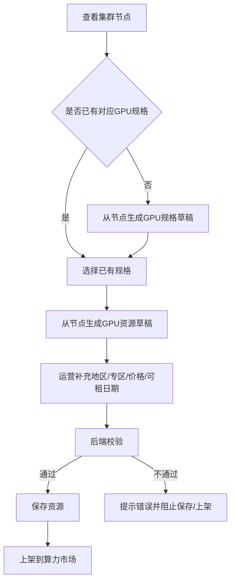

# GPU资源管理链路优化 PRD

## 1. 文档信息

| 项目 | 内容 |
| --- | --- |
| 文档名称 | GPU资源管理链路优化 PRD |
| 版本 | v1.0 |
| 日期 | 2026-07-11 |
| 涉及端 | 管理后台、用户端算力市场、后端资源服务、GPU 调度器对接 |
| 涉及页面 | 集群管理、GPU规格管理、GPU资源管理 |
| 涉及代码模块 | `ux-admin-main/src/views/gpu/*`、`console-main/ai-cloud-system/src/main/java/com/lingyang/cloud/*` |

## 2. 背景

当前管理后台 AI 算力中心下已经有三类 GPU 管理能力：

- 集群管理：展示调度器侧 GPU 集群、节点、节点池、资源汇总等真实资源信息。
- GPU规格管理：维护本地 GPU 型号/规格目录，支持从集群节点带出部分规格信息。
- GPU资源管理：维护最终可售 GPU 资源，配置机器、地区、专区、价格、库存、状态等，并影响用户端算力市场展示与下单。

这三类页面在业务上已经可以串联，但当前主要依赖运营人员手动选择和手工修正。规格、资源、集群节点之间缺少强约束，库存和状态也没有和集群事实源形成稳定同步机制，可能导致前台售卖数据与实际可调度资源不一致。

本 PRD 目标是把这三类页面从“可人工串联”升级为“有清晰边界、有校验、有闭环”的 GPU 商品化管理流程。

## 3. 问题定义

### 3.1 当前链路


### 3.2 当前主要问题

| 问题 | 表现 | 影响 |
| --- | --- | --- |
| 规格与节点事实混杂 | GPU规格保存节点名称、GPU总量、可用GPU、CPU/内存/磁盘等动态字段 | 规格目录不稳定，节点变化后规格数据容易过期 |
| 资源与节点缺少强绑定 | GPU资源可手动选择任意规格、任意节点信息 | 可能出现资源规格与真实节点 GPU 型号不一致 |
| 库存依赖本地手填 | `availableCount/totalCount` 保存到本地库存表 | 集群实际可用 GPU 变化后，前台仍可能展示可租 |
| 后端校验不足 | 保存资源时只做必填校验，缺少业务一致性校验 | 绕过前端可写入脏数据，影响市场和下单 |
| 删除/停用缺少引用保护 | 规格可被删除，资源可被删除 | 已售资源、订单、实例追溯可能断链 |
| 搜索语义不清 | 节点远程搜索 keyword 被当作 `gpuModel` 传参 | 用户以为搜节点名，实际可能查不到 |

## 4. 产品目标

### 4.1 核心目标

1. 建立清晰的数据边界：集群是事实源，规格是型号模板，资源是可售商品。
2. 建立从集群节点到规格、再到可售资源的标准创建流程。
3. 在资源保存、上架、删除、停用等关键节点增加后端一致性校验。
4. 降低运营手工配置错误，避免前台展示不可售或无法调度的 GPU 资源。
5. 为后续自动同步库存、自动生成资源草稿、资源健康巡检打基础。

### 4.2 非目标

本期不直接实现以下内容：

- 不重构整个 GPU 调度器。
- 不替换现有前台算力市场下单流程。
- 不实现完全自动售卖策略，例如自动定价、自动上下架。
- 不废弃手工维护入口，但要对手工入口增加约束和提示。

## 5. 用户角色

| 角色 | 使用场景 | 核心诉求 |
| --- | --- | --- |
| 平台运营 | 上架/下架 GPU 资源，维护价格和库存 | 快速、安全地把真实节点包装成可售资源 |
| 算力运维 | 查看集群节点、节点状态、GPU 可用量 | 管理后台展示与真实集群状态一致 |
| 财务/商务 | 配置不同计费类型价格 | 避免价格缺失或错误导致订单异常 |
| 终端用户 | 在算力市场选择 GPU 并创建实例 | 看到的库存真实可用，下单后可正常创建 |

## 6. 目标业务模型

### 6.1 数据边界

| 对象 | 定位 | 数据来源 | 是否本地持久化 | 示例字段 |
| --- | --- | --- | --- | --- |
| 集群节点 | 真实资源事实源 | GPU 调度器 | 否，或仅缓存 | `clusterId`、`nodeName`、`gpuModel`、`gpuCount`、`availableGpus`、`status` |
| GPU规格 | 商品模板/型号目录 | 人工维护，可从节点初始化 | 是 | `model`、`vram`、`architecture`、`tags`、`sortOrder` |
| GPU资源 | 可售商品资源 | 人工确认，可从节点生成 | 是 | `resourceNo`、`specId`、`clusterId`、`clusterNodeName`、`price`、`stock`、`status` |
| 库存 | 可售库存快照 | 集群同步 + 人工安全上限 | 是 | `totalCount`、`availableCount`、`reservedCount` |
| 订单/实例 | 用户购买结果 | 用户端下单 | 是 | `orderNo`、`resourceId`、`instanceId`、`status` |

### 6.2 推荐流程



## 7. 功能需求

### 7.1 集群管理

#### 7.1.1 集群节点列表

保留当前节点列表能力，并增强节点作为上游事实源的可用性。

需求：

- 支持按节点名称、集群 ID、GPU 型号、状态搜索。
- 节点列表展示字段包括：节点名称、集群 ID/名称、状态、GPU 型号、GPU 总量、已分配 GPU、可用 GPU、CPU、内存、磁盘、更新时间。
- 节点状态至少区分：Ready、NotReady、Unknown。
- 对 NotReady 节点提供明确标识，避免运营误选。

验收标准：

- 输入节点名可以查到对应节点。
- 输入 GPU 型号可以查到对应型号节点。
- NotReady 节点在下游生成资源时默认不可上架。

#### 7.1.2 节点操作入口

在节点列表增加操作入口：

- 生成规格草稿。
- 生成资源草稿。
- 查看节点详情。

规则：

- 如果节点缺少 GPU 型号，不允许生成规格/资源，并提示“节点缺少 GPU 型号信息”。
- 如果节点可用 GPU 为 0，允许生成资源草稿，但默认状态为维护中或下架。

### 7.2 GPU规格管理

#### 7.2.1 规格定位调整

GPU规格应定位为“可售型号模板”，不再承担实时库存职责。

保留字段：

- 型号 `model`
- 显存 `vram`
- 架构 `architecture`
- 描述 `description`
- 标签 `tags`
- 排序 `sortOrder`
- 状态 `status`

建议弱化或迁移字段：

- `clusterNodeName`
- `clusterStatus`
- `gpuCount`
- `allocatedGpus`
- `availableGpus`
- `cpuTotalCores`
- `memoryTotalGi`
- `diskTotalGi`

短期兼容策略：

- 字段可以继续保存和展示，但在 UI 上标记为“来源节点快照”。
- 不再把这些字段作为规格的核心判定依据。
- 后续新增规格时，从节点带出的动态字段只作为默认值，不作为长期库存依据。

#### 7.2.2 从节点生成规格草稿

入口：集群节点列表、GPU规格新增弹窗。

字段映射：

| 节点字段 | 规格字段 | 规则 |
| --- | --- | --- |
| `gpu_model` | `model` | 必填 |
| GPU 型号中的显存信息 | `vram` | 优先解析，如无法解析则要求手填 |
| GPU 型号/节点标签 | `tags` | 可选推荐标签 |
| `cpu.model` | `cpuModel` | 仅作为来源快照 |

校验规则：

- 同一 `model + vram` 不建议重复创建规格；如已存在，提示运营复用已有规格。
- 启用规格前必须填写 `model` 和 `vram`。
- 停用规格时，如果存在上架资源引用该规格，需要二次确认或阻止。

### 7.3 GPU资源管理

#### 7.3.1 从节点生成资源草稿

新增资源时，推荐第一步选择来源节点。

字段映射：

| 节点字段 | 资源字段 | 规则 |
| --- | --- | --- |
| `cluster_id` | `clusterId` | 保存来源集群 |
| `cluster_name` | `clusterName` | 保存来源集群名称 |
| `node_name` | `clusterNodeName`、`machineId` | 默认带出，可编辑受控 |
| `uid/uuid/node_uid` | `machineUuid` | 优先使用真实 UUID，缺失时提示 |
| `gpu_model` | `specId` | 匹配已有规格，未匹配则引导创建规格 |
| `gpu_count` | `gpuCount`、`totalCount` | 总量默认值 |
| `available_gpus` | `availableCount` | 可用库存默认值 |
| `cpu.total_cores` | `cpuCores` | 默认值 |
| `cpu.model` | `cpuModel` | 默认值 |
| `memory.total_gi` | `memorySize` | 格式化为 GiB |
| `disk.total_gi` | `dataDisk` | 格式化为 GiB |
| `status` | `status` | Ready 默认上架候选，非 Ready 默认维护中 |

#### 7.3.2 资源保存校验

保存资源时后端必须校验：

| 校验项 | 规则 | 不通过提示 |
| --- | --- | --- |
| 规格存在且启用 | `specId` 必须对应启用规格 | GPU规格不存在或已停用 |
| 节点存在 | 绑定集群节点时，节点必须仍存在 | 来源节点不存在，请刷新后重试 |
| 节点状态 | 上架资源绑定的节点必须 Ready | 节点未就绪，不能上架 |
| GPU 型号一致 | 资源规格型号应与节点 GPU 型号一致，或需要显式确认 | 规格型号与节点型号不一致 |
| 库存范围 | `0 <= availableCount <= totalCount <= node.gpu_count` | 库存数量超过节点可用范围 |
| 地区专区 | 地区和专区必须启用，专区如有关联地区则必须匹配 | 地区或专区不可用 |
| 价格有效 | 至少一个计费类型 `unitPrice > 0` 或 `discountPrice > 0` | 至少维护一个有效价格 |
| 可租日期 | `rentableUntil` 不能早于当前日期 | 可租截止日期无效 |
| 唯一性 | 同一个 `clusterId + clusterNodeName` 不应重复上架同一 GPU 资源 | 该节点已有上架资源 |

#### 7.3.3 上架校验

资源状态从下架/维护中切到上架时，需要执行比保存更严格的校验：

- 节点 Ready。
- 可用库存大于 0。
- 价格有效。
- 规格启用。
- 地区和专区启用。
- 镜像/组件配置有效，如资源要求组件。

校验失败时，状态不变并返回具体错误原因。

#### 7.3.4 删除和停用保护

资源删除规则：

- 若存在未完成订单、运行中实例、创建中实例，不允许删除。
- 可改为下架或维护中。
- 删除成功后保留操作日志。

规格删除/停用规则：

- 若存在资源引用该规格，不允许物理删除。
- 若存在上架资源引用该规格，不允许停用。
- 若只存在下架资源引用，可提示用户先处理资源后再停用。

### 7.4 库存同步与巡检

#### 7.4.1 短期方案：保存和上架时实时校验

本期最低要求：

- 资源保存时读取一次调度器节点详情进行校验。
- 资源上架时读取一次调度器节点详情进行校验。
- 前台下单创建前继续执行库存校验。

#### 7.4.2 中期方案：库存定时同步

增加定时任务：

- 每 1-5 分钟同步绑定节点的 GPU 可用量。
- 如果本地 `availableCount` 大于调度器可用量，自动下调本地可售库存。
- 如果节点 NotReady，自动把资源标记为维护中或生成告警。
- 同步过程写入资源健康记录。

#### 7.4.3 库存安全上限

允许运营配置“可售上限”：

- `saleLimitCount`：运营希望最多售卖多少卡。
- 实际可售库存 = `min(saleLimitCount, schedulerAvailableGpus - reservedCount)`。

这样既能避免超卖，也保留运营控制能力。

### 7.5 组件和镜像配置

资源创建实例依赖镜像和组件能力。资源管理需要和组件管理形成关联。

需求：

- GPU资源新增/编辑增加“组件配置”区块。
- 仅展示启用组件。
- 支持多选组件，并保存组件 ID、名称、基础镜像、镜像地址、排序。
- 创建实例时优先使用资源绑定组件，未绑定时走全局组件/镜像策略。

校验：

- 上架资源时，如业务要求必须有基础镜像，则至少绑定一个可用组件。
- 组件停用时，如果被上架资源引用，需要阻止或提示先解绑资源。

## 8. 页面需求

### 8.1 集群管理页面

新增/优化：

- 节点列表增加“生成规格”“生成资源”操作。
- 节点详情展示资源使用情况和最近同步时间。
- 搜索项拆分为：节点名称、GPU 型号、状态、集群 ID。
- 节点状态异常时突出展示原因。

### 8.2 GPU规格管理页面

新增/优化：

- 新增规格弹窗支持从节点生成草稿。
- 如果已有相同型号规格，提示“复用已有规格”。
- 来源节点信息改为“来源快照”，避免误解为实时库存。
- 列表增加“引用资源数”。
- 删除/停用时展示引用资源明细。

### 8.3 GPU资源管理页面

新增/优化：

- 新增资源抽屉第一项为“来源节点”，推荐选择。
- 选择节点后自动匹配规格；未匹配时支持跳转创建规格。
- 表单显示“集群实时值”和“本地配置值”的差异提示。
- 价格区块提示至少维护一个有效价格。
- 库存区块展示：节点总 GPU、节点可用 GPU、本地可售库存。
- 上架按钮执行预校验，失败时弹出错误清单。
- 列表增加健康状态：正常、库存不一致、节点不可用、价格缺失、规格停用。

## 9. 后端需求

### 9.1 新增资源校验服务

新增 `GpuResourceValidationService`，统一处理：

- 保存校验。
- 上架校验。
- 删除校验。
- 规格停用/删除校验。

建议返回结构：

```json
{
  "valid": false,
  "errors": [
    {
      "field": "availableCount",
      "code": "STOCK_EXCEEDS_NODE_AVAILABLE",
      "message": "可售库存超过节点可用GPU数量"
    }
  ],
  "warnings": []
}
```

### 9.2 新增预校验接口

建议接口：

| 接口 | 方法 | 用途 |
| --- | --- | --- |
| `/system/gpu/resource/validate` | POST | 保存前预校验资源草稿 |
| `/system/gpu/resource/status/validate` | POST | 上架前校验 |
| `/system/gpu/spec/reference` | GET | 查询规格被哪些资源引用 |
| `/system/gpu/resource/health/page` | GET | 查询资源健康状态 |

### 9.3 现有接口增强

| 接口 | 增强点 |
| --- | --- |
| `POST /system/gpu/resource/save` | 保存前调用资源校验服务 |
| `POST /system/gpu/resource/status` | 上架时调用上架校验服务 |
| `GET /system/gpu/spec/delete` | 删除前检查资源引用 |
| `GET /system/gpu/spec/status` | 停用前检查上架资源引用 |
| `GET /system/gpu/cluster/node/page` | 支持节点名称、GPU 型号、集群 ID、状态独立搜索 |

## 10. 数据模型建议

### 10.1 短期复用现有表

短期优先复用：

- `gpu_resource`
- `gpu_resource_spec`
- `gpu_resource_price`
- `gpu_resource_stock`
- `gpu_resource_component`

### 10.2 建议新增字段

| 表 | 字段 | 说明 |
| --- | --- | --- |
| `gpu_resource_stock` | `sale_limit_count` | 运营配置可售上限 |
| `gpu_resource_stock` | `reserved_count` | 已预占未完成创建的数量 |
| `gpu_resource_stock` | `scheduler_available_count` | 最近一次调度器同步可用数 |
| `gpu_resource` | `health_status` | 资源健康状态 |
| `gpu_resource` | `last_sync_time` | 最近集群同步时间 |
| `gpu_resource` | `last_sync_message` | 最近同步说明 |

### 10.3 建议新增表

#### `gpu_resource_health_log`

记录资源巡检和同步结果。

| 字段 | 说明 |
| --- | --- |
| `id` | 主键 |
| `resource_id` | GPU资源 ID |
| `cluster_id` | 集群 ID |
| `cluster_node_name` | 节点名称 |
| `health_status` | 健康状态 |
| `check_type` | 检查类型：save/status/sync/order |
| `message` | 检查结果说明 |
| `snapshot_json` | 调度器节点快照 |
| `create_time` | 创建时间 |

## 11. 状态定义

### 11.1 资源业务状态

| 状态 | 值 | 含义 |
| --- | --- | --- |
| 上架 | 1 | 可进入前台市场并允许下单 |
| 下架 | 2 | 不进入前台市场，不允许新下单 |
| 维护中 | 3 | 不允许新下单，用于节点异常或人工维护 |

### 11.2 资源健康状态

| 状态 | 含义 | 是否允许上架 |
| --- | --- | --- |
| normal | 正常 | 是 |
| node_not_ready | 节点未就绪 | 否 |
| node_missing | 节点不存在 | 否 |
| spec_disabled | 规格已停用 | 否 |
| price_missing | 缺少有效价格 | 否 |
| stock_mismatch | 库存不一致 | 否，需修正 |
| component_invalid | 组件无效 | 否，视业务配置 |

## 12. 用户故事

### 12.1 从集群节点生成可售资源

作为平台运营，我希望在集群节点列表中选择一个 Ready 节点并生成 GPU 资源草稿，这样我只需要补充价格、地区、专区和可租日期，就能安全上架。

验收：

- 选择节点后自动带出机器 ID、GPU 型号、GPU 数量、CPU、内存、磁盘、库存。
- 如果没有匹配规格，系统提示先创建规格。
- 保存前展示校验结果。

### 12.2 阻止错误上架

作为平台运营，我希望当节点 NotReady、库存为 0、价格缺失时，系统阻止资源上架，这样用户不会在前台买到无法创建的资源。

验收：

- 点击上架时执行后端校验。
- 校验失败时资源状态不变。
- 错误提示展示具体失败原因。

### 12.3 防止规格误删

作为平台运营，我希望删除 GPU 规格前看到引用该规格的资源列表，这样不会误删正在售卖的资源依赖。

验收：

- 有资源引用时不允许删除规格。
- 有上架资源引用时不允许停用规格。
- 提供跳转资源列表的能力。

### 12.4 库存自动校准

作为运维人员，我希望系统能定期对比本地库存与集群可用 GPU，这样集群变化后前台库存不会长期错误。

验收：

- 定时同步绑定节点的可用 GPU。
- 本地可售库存超过真实可用时自动下调或标记异常。
- 同步结果可在资源健康日志查看。

## 13. 验收标准

### 13.1 功能验收

- 集群节点可生成规格草稿和资源草稿。
- GPU资源保存时执行后端业务校验。
- GPU资源上架时执行更严格校验。
- GPU规格删除/停用前检查资源引用。
- GPU资源列表能展示健康状态。
- 前台算力市场不展示不健康或不可售资源。

### 13.2 数据验收

- 上架资源必须满足：规格启用、节点 Ready、库存有效、价格有效。
- `availableCount` 不得大于 `totalCount`。
- `totalCount` 不得大于节点 GPU 总量。
- 绑定节点资源的 GPU 型号应与规格型号一致。
- 被上架资源引用的规格不能停用或删除。

### 13.3 异常验收

- 调度器不可用时，保存资源允许保存草稿，但不允许上架。
- 节点消失时，资源健康状态变为 `node_missing`。
- 节点 NotReady 时，资源健康状态变为 `node_not_ready`，资源应自动进入维护中或产生告警。
- 价格全部为 0 时，不允许上架。

## 14. 分期计划

### P0：校验闭环

- 增加资源保存/上架后端校验。
- 增加规格删除/停用引用保护。
- 修复节点搜索语义。
- 资源列表展示健康状态。

### P1：标准创建流程

- 集群节点列表增加“生成规格”“生成资源”。
- GPU资源新增抽屉改为节点优先流程。
- 资源草稿支持校验预览。

### P2：库存同步与健康巡检

- 增加库存同步任务。
- 增加资源健康日志。
- 支持异常资源自动维护中或告警。

### P3：运营效率增强

- 支持批量生成资源草稿。
- 支持批量价格配置。
- 支持资源上架前检查报告导出。

## 15. 风险与依赖

| 风险 | 说明 | 应对 |
| --- | --- | --- |
| 调度器接口字段不稳定 | 当前代码兼容 snake_case/camelCase 多种字段 | 后端统一做字段归一化 DTO |
| 历史数据不完整 | 已有资源可能缺少 clusterId/nodeName | 增加历史数据补录和健康状态“未绑定节点” |
| 校验过严影响运营 | 运营可能需要先保存草稿 | 区分保存草稿和上架校验 |
| 库存同步影响售卖 | 自动下调库存可能影响展示 | 先做健康标记，再灰度自动下调 |
| 规格字段迁移成本 | 当前规格已保存动态字段 | 短期保留字段并标记为来源快照 |

## 16. 埋点与指标

建议监控：

- 资源保存校验失败次数。
- 资源上架校验失败次数。
- 库存不一致资源数。
- 节点异常导致维护中资源数。
- 从节点生成资源的成功率。
- 前台下单因资源不足失败次数。

核心成功指标：

- 前台因资源库存不一致导致的创建失败率下降。
- GPU资源上架配置错误率下降。
- 从节点到资源上架的运营耗时下降。

## 17. 待确认问题

1. 是否允许一个集群节点拆分成多个可售资源？例如一台 8 卡机器拆成多个 1/2/4 卡资源。
2. 前台“资源”是否代表整机、单卡规格，还是可配置 GPU 数量的资源池。
3. 资源库存是否需要支持预占，例如用户提交订单后先冻结库存，创建失败再释放。
4. 调度器是否能稳定返回节点 UUID、集群 ID、GPU 型号、可用 GPU 等字段。
5. 组件/镜像是否是资源上架必填项，还是创建实例时由用户选择镜像即可。
6. 历史订单和实例是否已保存资源快照，是否允许删除已产生订单的资源。

## 18. 参考代码位置

| 模块 | 路径 |
| --- | --- |
| GPU资源管理页面 | `ux-admin-main/src/views/gpu/resource/index.vue` |
| GPU资源新增/编辑抽屉 | `ux-admin-main/src/views/gpu/resource/components/ResourceDrawer.vue` |
| GPU规格管理页面 | `ux-admin-main/src/views/gpu/spec/index.vue` |
| 集群节点管理页面 | `ux-admin-main/src/views/gpu/cluster/index.vue` |
| 集群列表页面 | `ux-admin-main/src/views/gpu/cluster/list/index.vue` |
| 管理端 GPU API | `ux-admin-main/src/api/gpuResource.ts`、`gpuSpec.ts`、`gpuCluster.ts` |
| 后端管理接口 | `console-main/ai-cloud-system/src/main/java/com/lingyang/cloud/api/controller/system/SystemGpuResourceController.java` |
| GPU资源服务 | `console-main/ai-cloud-system/src/main/java/com/lingyang/cloud/service/impl/GpuResourceServiceImpl.java` |
| GPU规格服务 | `console-main/ai-cloud-system/src/main/java/com/lingyang/cloud/service/impl/GpuResourceSpecServiceImpl.java` |

